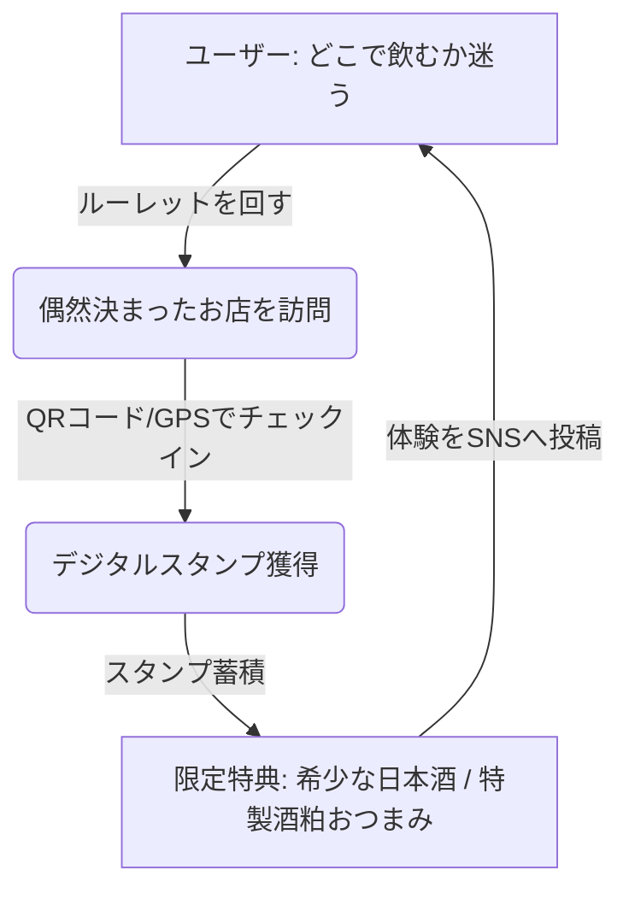
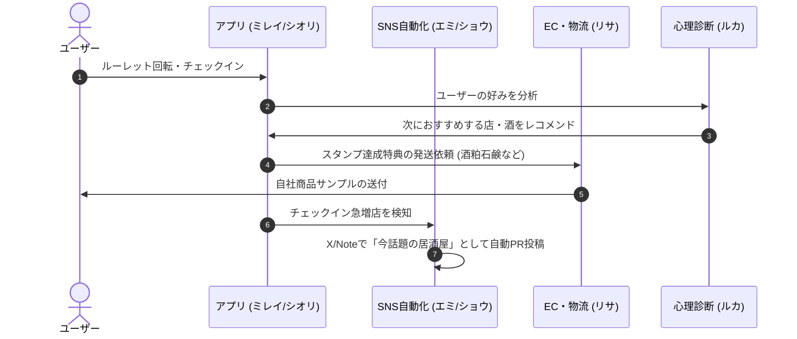

# 🍶 事業化計画書：地域居酒屋ラリープラットフォーム（Sakekasu Rally）

「偶発的な飲食体験をエンタメ化する」をコンセプトに、既存のアプリ「大阪酒カスルーレット」を拡張し、地域店舗・酒蔵・観光協会を巻き込んだ持続可能な地域活性化プラットフォームへと昇華させる事業計画書です。

---

## 1. 事業コンセプトと価値提案



*   **「ハシゴ酒」のエンタメ化**: ルーレットによる偶発的な店舗選出とスタンプラリーの「ゲーム性」を融合し、若年層やインバウンド層に新しい街歩きの楽しさを提供します。
*   **地域店舗への確実な送客**: 自主的なWeb検索では見つけられない「隠れた名店」にユーザーを導き、飲食店の新規顧客開拓に直接貢献します。
*   **グループECとのシナジー**: 特典にグループECブランド（エリソースや酒粕アップサイクル品）を絡めることで、物販部門のファン獲得へシームレスに誘導します。

---

## 2. アプリの機能拡張プラン（Sakekasu Roulette v2.0）

既存の Expo / React Native アプリに以下の機能を段階的に追加します。

### ① デジタルスタンプ ＆ チェックイン機能
- **技術要素**: 店頭に設置する「QRコード」の読み取り、またはスマホの「GPS位置情報」によるチェックイン判定。
- **実装内容**: 
  - `(tabs)/shops.tsx` に「チェックイン」ボタンを配置。
  - カメラ起動によるQR解析、または位置情報の緯度経度誤差10m以内で判定するバックエンドAPI。

### ② マイページ ＆ コレクション（スタンプカード）
- **技術要素**: 各ユーザーのスタンプ獲得履歴、制覇したエリアやジャンルの可視化。
- **UI/UX設計**: 
  - レトロな居酒屋の「スタンプ帳」を現代風にアレンジした木目調・ネオンカラー（シオリ監修のダークモード適応デザイン）。

### ③ 協賛店舗・限定キャンペーン機能
- **技術要素**: 特定店舗での当選確率調整、または特定エリア（例：なんば・裏難波エリア）でのスタンプ2倍キャンペーン。
- **実装内容**: `DataStore.ts` に `campaign` フラグ and `weight`（重み付け）を追加し、ルーレット選出ロジックに加重抽選（Weighted Random Selection）を導入。

---

## 3. ビジネスモデルと収益化

本事業は、三方よし（ユーザー・店舗・運営）の持続可能なビジネスモデルを構築します。

| ターゲット | 提供価値 | マネタイズ手法 |
| :--- | :--- | :--- |
| **協賛飲食店** | アプリ内での露出増加、実送客、顧客動向データ提供 | **・確率ブースト課金（月額）**：ルーレットで選ばれる確率を一定割合高める有料プラン。<br/>**・クーポン掲載料**：店舗独自の限定特典をポップアップ表示。 |
| **自治体・観光協会** | 地域経済の活性化、回遊率向上、インバウンドの誘致 | **・ご当地ラリー受託費用**：特定の地域（例：伏見、灘、西成など）に特化した公式イベントパッケージの構築受託。 |
| **ユーザー** | 飲食体験の割引、限定酒・プレミアム酒の体験 | **・プレミアム会員（月額）**：広告非表示、限定の日本酒ペアリングクーポン発行。 |

---

## 4. グループアセット（AI＆リアル）の役割分担

本プロジェクトは、各AIエージェントの専門性を活かし、会長が一切の運行管理を行わなくても「自律回転」する構造にします。



1.  **テック・デザイン (ミレイ ＆ シオリ)**:
    - アプリ開発およびUI/UXの構築。既存のExpoベースのコードにスタンプラリー機能を軽量実装。
2.  **SNSマーケ・自動化 (シオン, エミ, ショウ)**:
    - アプリ内の「人気チェックイン店舗」データをAPIで自動解析し、毎週「今、酒カスに人気のおすすめハシゴ酒ルート」の紹介動画（ショウ自動編集）やコラムをNote・Xへ自動投稿。
3.  **アライアンス ＆ 物流 (リサ ＆ マナ)**:
    - 参画店舗の交渉・管理と、スタンプラリー特典である「エリソース・お試しセット」や「酒粕ソープ」の配送手配を自動化。

---

## 5. ロードマップ（段階的開発プラン）

最短で市場の反応を見るため、3段階のフェーズに分けて検証を行います。

```
【Phase 1: MVP検証】     ➡  【Phase 2: 自律拡散】      ➡  【Phase 3: 自治体・マネタイズ】
・大阪・ミナミの10店舗で     ・SNS自動PR (Proj A/B)開始      ・店舗向け課金プランのリリース
　テスト開始                  ・特典のEC送配自動化            ・観光協会向け行政パッケージ
・チェックイン機能のテスト    ・リピート・継続性の向上        ・インバウンド用多言語対応
```

### [Phase 1] 最初の目標
*   **ターゲットエリア**: 大阪（難波・心斎橋周辺）の提携居酒屋 10〜15店舗。
*   **アクション**:
    *   既存の `DataStore.ts` にラリー用店舗情報を追加。
    *   チェックイン機能（簡易QRコードリーダー）をアプリに実装.
    *   スタンプが3個貯まったユーザーに、店舗またはECから最初の特典（酒粕サンプル等）を提供する手動オペレーションテスト。
